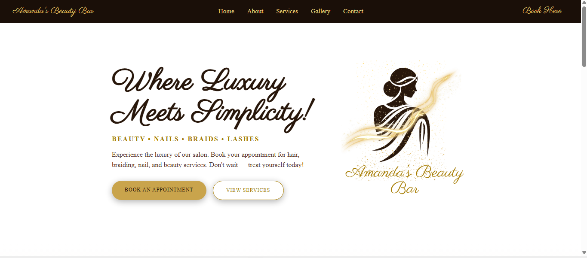
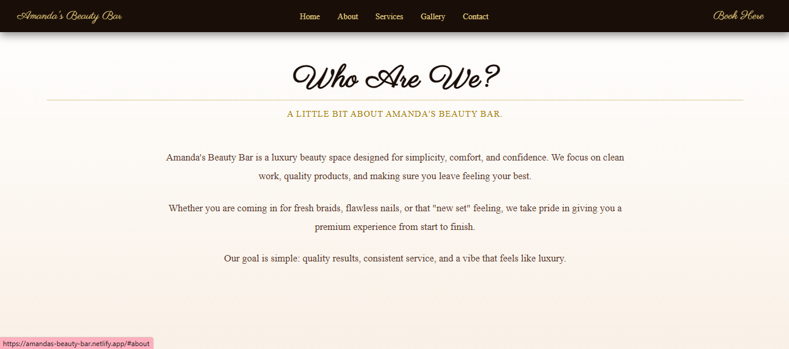
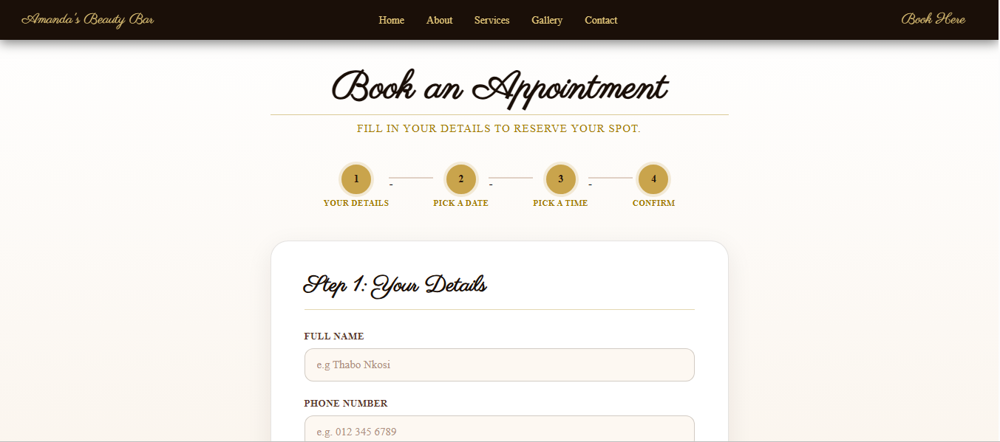
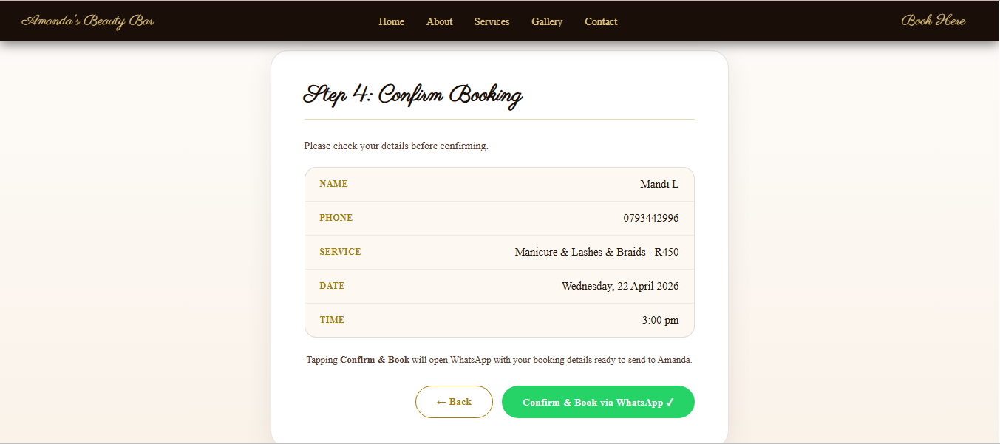

# Amanda's Beauty Bar 💄

A responsive multi-page beauty salon website built with HTML, CSS, and JavaScript. Created for a real client to give their beauty business a professional online presence with a fully functional booking experience.

🔗 **Live Site:** https://amandas-beauty-bar.netlify.app/

---

## Features

- Responsive layout for mobile and desktop
- Sticky navigation with smooth scroll section linking
- Mobile hamburger menu with slide-in drawer
- Hero section with strong visual branding
- Services section with pricing
- Photo gallery
- Multi-step booking form (details → date → time → confirm)
- WhatsApp redirect with pre-filled booking message
- Polished UI with consistent luxury brand aesthetic

---

## Preview

---

## Built With

- HTML5
- CSS3
- Vanilla JavaScript
- Google Fonts (Parisienne)
- Netlify (deployment)

---

## Pages

| Page | Description |
|------|-------------|
| `index.html` | Homepage — hero, about, services, contact |
| `gallery.html` | Photo gallery of salon work |
| `booking.html` | Multi-step booking form |

---

## Booking Flow

1. Client fills in name, phone number and selects a service
2. Client picks a date from an interactive calendar
3. Client selects a time slot
4. Client reviews a booking summary and confirms
5. WhatsApp opens with a pre-filled message ready to send to the stylist

---

## Project Focus

This project gave me hands-on experience building a real client-facing website from scratch. Key areas of focus included responsive design, multi-page structure, JavaScript DOM manipulation, form validation, and translating a brand vision into a functional and polished frontend interface.

---

## Future Improvements

- Animate sections on scroll
- Improved form input validation with inline error messages
- Accessibility improvements (ARIA labels, keyboard navigation)
- Success screen after booking confirmation
